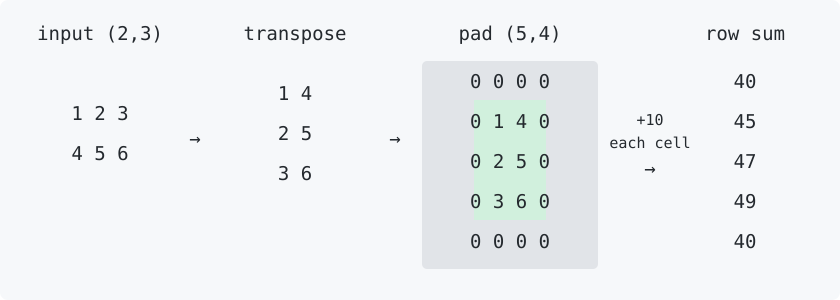

# A complete trace: transpose → pad → add → reduce

[All tutorials](README.md) · Updated September 21, 2026 · [tinygrad `8ad8f73`](https://github.com/tinygrad/tinygrad/tree/8ad8f738755c3ab157d356aedd5d5c108aa1a642)

This walkthrough follows one computation through actual captured UOps and executed CPU and Metal programs. It is not a reconstruction of the old ShapeTracker pipeline. The captures use Python 3.14.6, BEAM=0, CPU arm64/ClangRenderer and METAL Apple7/MetalRenderer. The revision was checked against upstream when these notes were written; it is a reproducibility pin, not a promise that future tinygrad will produce identical graphs.

## 1. Establish the answer before looking at the compiler

```python
from tinygrad import Tensor

x = Tensor([[1., 2., 3.], [4., 5., 6.]]).realize()
y = (x.T.pad(((1, 1), (1, 1))) + 10).sum(axis=1)
assert y.tolist() == [40., 45., 47., 49., 40.]
# Moving addition inside padding changes the meaning.
other = (x.T + 10).pad(((1, 1), (1, 1))).sum(axis=1)
assert other.tolist() == [0., 25., 27., 29., 0.]
```

The input is realized before tracing, so its initialization is not mistaken for part of the kernel under study. Transposition changes `(2, 3)` to `(3, 2)`; padding changes that to `(5, 4)`; reducing axis 1 leaves five elements.



The diagram is an explanatory drawing, not VIZ output. Here is the same arithmetic in text, before adding ten:

```text
0 0 0 0  →  40
0 1 4 0  →  45
0 2 5 0  →  47
0 3 6 0  →  49
0 0 0 0  →  40
```

Each row receives four additions of ten. The zero-padded cells are real values in the expression, not permission to skip the later addition.

## 2. Tensor graph: movement is still explicit

Read the [captured Tensor graph](traces/movement-cpu/01-tensor.txt). Following its dependencies from the input gives `BUFFER → RESHAPE → PERMUTE → PAD → ADD → PERMUTE → REDUCE` (constants and shape operands omitted here).

Why two permutations? The first is our transpose. The second puts the reduced dimension first for the internal reduction representation. In this capture, `REDUCE` has `arg=(Ops.ADD, 1)`: one leading dimension is reduced. That `1` is not simply the public `axis=1` copied into the IR.

The internal `PAD` sources contain `(1, 1)` offsets and `(5, 4)` output dimensions. Do not read these as the public API's `((before, after), ...)` pairs.

## 3. Rangeification: derive the address and its validity

The [prepared graph](traces/movement-cpu/02-prepared.txt) is the actual argument received by `run_rangeify`. Its [returned graph](traces/movement-cpu/03-rangeified.txt) uses explicit ranges, an indexed store, and an indexed input.

Call the output coordinate `i`, with `0 <= i < 5`, and the reduction coordinate `k`, with `0 <= k < 4`. Propagating coordinates backward:

| Boundary | Coordinates or address |
| --- | --- |
| Padded tensor | `(i, k)` |
| Undo padding | `(i - 1, k - 1)` |
| Undo transpose | `(k - 1, i - 1)` |
| Flatten original `(2, 3)` | `3*(k - 1) + (i - 1) = 3*k + i - 4` |

The coordinate is valid only when `1 <= i < 4` and `1 <= k < 3`. The graph represents both an invalid-index sentinel and a zero-valued alternative. Its meaning can be summarized as:

```text
valid = (1 <= i < 4) and (1 <= k < 3)
padded_value = input[3*k + i - 4] if valid else 0
output[i] = sum(padded_value + 10 for k in range(4))
```

This is explanatory pseudocode, not emitted source. In the capture, an inner `WHERE` selects the address or `Invalid`; an outer `WHERE` selects the indexed value or floating-point zero. Reading address `-4` unconditionally and selecting zero afterward would not be an equivalent implementation.

The reduction now has `arg=(Ops.ADD, 0)` and an explicit reduction `RANGE` source. Range IDs can change in later transformations; follow dependencies and `AxisType`, not an assumed permanent axis number.

## 4. Schedule: one call, two buffers

The [scheduled graph](traces/movement-cpu/05-schedule.txt) has one `CALL` in its outer `LINEAR`. Its kernel body is a `SINK` with `STORE`/`END` structure. The output parameter has five floats; the input parameter has six. The call supplies their buffer UOps.

There is no separately materialized 20-element padded tensor in this schedule. Its mapping and zero behavior are part of the consuming kernel. This is evidence about this pinned expression, not a rule that every transpose or padding operation always fuses.

For why other graphs need multiple calls and buffer-state ordering, see [scheduling](scheduleitem.md). Creating the schedule also updates Tensor references: the capture script executes the returned schedule before inspecting `y`.

## 5. Compiled CPU source: where did the loops go?

The [complete generated CPU source](traces/movement-cpu/07-source.txt) loads input elements 0–3 as a `float4` and elements 4–5 as a `float2`. Its stores compute:

```text
output[0] = 40
output[1] = input[3] + input[0] + 40
output[2] = input[4] + input[1] + 40
output[3] = input[5] + input[2] + 40
output[4] = 40
```

These assignments paraphrase the generated vector store. The actual source has no `for` loop and no runtime padding predicate. The small fixed ranges have been expanded and simplified: the compiler can determine which lanes are padding and which six input elements are needed. It has not made padding irrelevant; its effect survives in the constants and selected input pairs.

Both loads stay within the six-element allocation. The first four outputs are written with a vector store, and the fifth separately. A different target, larger shape, or optimization configuration may retain loops or predicates. A `RANGE` in the scheduled graph is not a promise of a source-language loop.

## 6. The same computation on Metal

The [Metal source](traces/movement-metal/07-source.txt) uses `device float*`, Metal `float4`/`float2` loads and `.x/.y/.z/.w` component access. It computes the same five expressions. The captured [ProgramInfo and results](traces/movement-metal/metadata.json) report global and local sizes `(1, 1, 1)`: this tiny program does not distribute five outputs across five threads. Its `gid` and `lid` parameters are unused.

That source was compiled and executed on Metal, not merely rendered. This establishes this example's output on this device; it is not a benchmark, a tensor-core test, or evidence of scalable GPU utilization. Follow [the Metal runtime chapter](20240921_metal.md) for compilation, binding, dispatch, and completion.

## Reproduce and inspect the capture

From this notes repository, with Python 3.11+ and the pinned tinygrad checkout available:

```sh
PYTHONPATH=/path/to/tinygrad DEV=CPU python3 scripts/trace_movement.py /tmp/movement-cpu
PYTHONPATH=/path/to/tinygrad DEV=METAL python3 scripts/trace_movement.py /tmp/movement-metal
```

The second command requires a working Metal device. The script rejects a different revision or modified tracked tinygrad implementation, disables schedule-cache reuse, observes `run_rangeify` without replacing its result, compiles the actual schedule, executes it, and asserts the answer. It saves Tensor/prepared/rangeified/scheduled/program graphs, generated source, operation counts, and provenance. There is no separate stage 04 file: kernel splitting is reflected in stage 05, not independently instrumented.

CPU [metadata](traces/movement-cpu/metadata.json) and Metal [metadata](traces/movement-metal/metadata.json) identify the captured targets. Generated binaries in program dumps are target-specific; do not expect byte-identical output across hosts. The regression examples below check semantics rather than matching source strings.

## Challenge the mapping, not just the happy path

This independent Python oracle combines transpose, reversal, asymmetric padding, row broadcasting, and reduction. Sizes straddle common vector widths; inputs include negative values. None of the expected answers is computed with tinygrad.

```python
from tinygrad import Tensor

for rows in (1, 2, 7):
  for cols in (1, 3, 31, 32, 33):
    data = [[float((r*7+c*3) % 19 - 9) for c in range(cols)] for r in range(rows)]
    # Transpose then reverse the new first axis; pad rows (2,1), columns (1,2).
    transformed = [[data[r][c] for r in range(rows)] for c in reversed(range(cols))]
    padded = [[0.]*(rows+3) for _ in range(2)]
    padded += [[0.] + row + [0., 0.] for row in transformed]
    padded += [[0.]*(rows+3)]
    bias = [float(i-2) for i in range(cols+3)]
    expected = [sum(v + b for v in row) for row, b in zip(padded, bias)]
    x = Tensor(data).realize()
    out = (x.T.flip(0).pad(((2, 1), (1, 2))) + Tensor(bias).reshape(-1, 1)).sum(axis=1)
    assert out.tolist() == expected, (rows, cols)
print("15 movement/broadcast/reduction cases passed")
```

These exact comparisons use small integer-valued floats whose sums are exactly representable. They do not establish arbitrary floating-point reassociation equivalence or cover empty dimensions, gradients, symbolic layouts, or every backend.

Implementation references: [Tensor preparation](https://github.com/tinygrad/tinygrad/blob/8ad8f738755c3ab157d356aedd5d5c108aa1a642/tinygrad/tensor.py), [coordinate propagation](https://github.com/tinygrad/tinygrad/blob/8ad8f738755c3ab157d356aedd5d5c108aa1a642/tinygrad/schedule/indexing.py), [kernel splitting](https://github.com/tinygrad/tinygrad/blob/8ad8f738755c3ab157d356aedd5d5c108aa1a642/tinygrad/schedule/rangeify.py), [codegen](https://github.com/tinygrad/tinygrad/blob/8ad8f738755c3ab157d356aedd5d5c108aa1a642/tinygrad/codegen/__init__.py).
